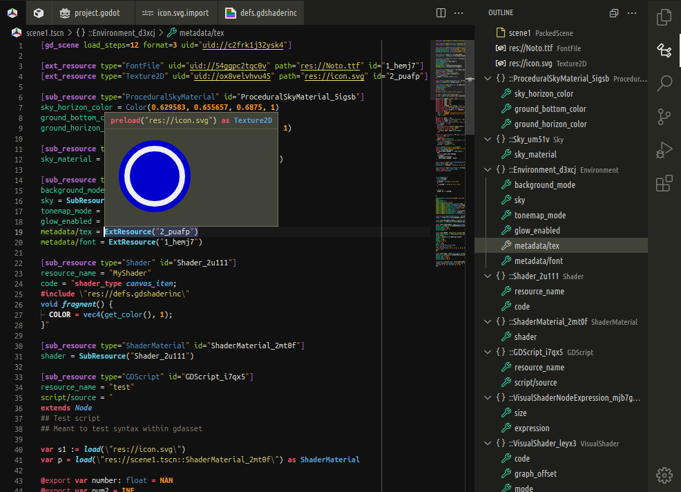
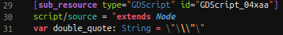
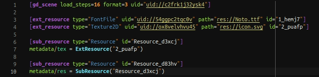
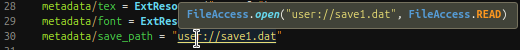
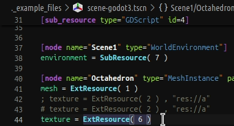
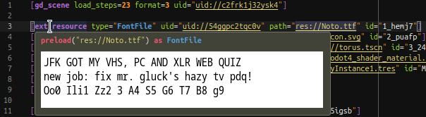
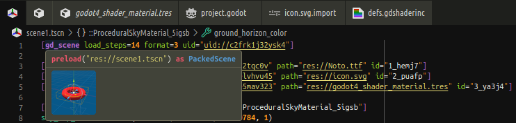
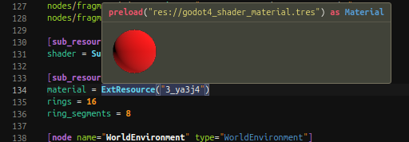
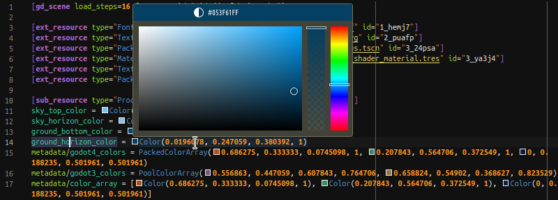
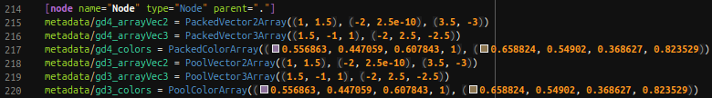

# Godot Files

Provides syntax-coloring for some files supported by Godot Editor.  
This is *not* meant to replace the official [godot-tools] extension, but to improve on its supported files. This plugin is designed so it can work alongside it, but it's completely independent. If you're using GDScript, you'll likely want to install godot-tools too.

[godot-tools]: https://github.com/godotengine/godot-vscode-plugin

**Compatibility**: Godot 3.x, 4.x  
This extension also works on browser IDEs ([vscode.dev](https://vscode.dev) and [github.dev](https://github.dev)), with limited functionality.

## Features

Includes syntax-coloring for these languages:

- **Godot Shader** files: `.gdshader`, `.gdshaderinc`.
- Better (more specific) grammar for the INI-like files used by Godot (Asset Properties Definition):  
  `.godot`, `.tscn`, `.escn`, `.tres`, `.gdns`, `.gdnlib`, `.import`, `.tet`, `.remap`.
- The same grammar is reused for `.cfg` and the INI-like XDG Desktop Entry files: `.desktop`, `.directory`.  
  You might want to associate this language (Configuration Properties) with other INI-like formats as well.

**INI-like** files also support:

- Outline and breadcrumb items.

**GDAsset** files (i.e., the INI-like Godot Asset files) also support:

- Syntax-coloring of embedded code in asset strings for GDScript and Godot Shader resources (see image above).  
  😎 It even handles both inner and outer languages' escape sequences gracefully, and colors them differently:  
  
- Navigate to definition of `SubResource` and `ExtResource` references, and to resource paths.  
  
- Hover resource references or paths to show code for loading in GDScript (`preload(…)`, `load(…)` or `FileAccess.open(…)`).  
  
- Hover image and font resource paths or their `ExtResource` references to preview them directly.  
  🔧 You can disable resource previews when hovering with the setting `godotFiles.hover.previewResource`.
  
    
  ✳️ Images supported: SVG, PNG, WebP, JPEG, BMP, GIF.
  
  The font preview shows all uppercase and lowercase ASCII letters and helps testing if they're too similar to numbers:  
    
  ✳️ Fonts supported: TTF, OTF, WOFF, WOFF2.
- **🌟 NEW FEATURE (NO LONGER RESTRICTED): 🌟**  
  Hover any resource (except sub-resources) to preview its thumbnail as generated by the Godot Editor.  
  Godot doesn't need to be running because it updates thumbnail files into the cache whenever a resource is saved.  
  🔧 The setting `godotFiles.hover.previewResource` also applies here.  
  ⚠️ If you're using Godot in [self-contained mode](https://docs.godotengine.org/en/stable/tutorials/io/data_paths.html#self-contained-mode), this requires adding the cache path with the setting `godotFiles.godotCachePath`.
  
  It works for scenes:  
  
  
  As well as any other resource files that have a thumbnail in Godot Editor:  
  

If you want **more features**, check the next section and [potential future development](#potential-future-development) below.

## Early Access

Features in early access are ready for use, but **restricted to supporters** at first.  
Each feature will usually stay restricted until the next new feature takes its place in a future version.

🔑 To unlock all features as soon as they arrive, please [donate] and copy the password, then use the ***Godot Files: Unlock features in early access*** command (right-click this extension in the panel) and paste it in the prompt. Doing this just once will permanently unlock everything in early access, even across updates.

🔒 **GDAsset** features currently restricted:
- Inline color decorators on `Color(…)` values and within arrays. Hover to edit the color or see its hex value.  
  🔧 You can disable this feature with the settings under `godotFiles.inlineColors` (`.single` and `.array`).  
    
  ✳️ The displayed color (and its hex value) can't consider advanced cases like HDR and color space changes (e.g. between sRGB and linear).
- Inlay hints surrounding items with implied parentheses in packed arrays of vectors or colors.  
  ✳️ This is *not* supported syntax in asset files! These parentheses are only shown for clarity.  
  🔧 You can disable this feature with the settings under `godotFiles.clarifyArrays` (`.vector` and `.color`).  
  

## Known Limitations

Parsing of INI-like files is very simplistic (line-based; doesn't use a robust parser library), but should work well for almost all cases where files were generated by Godot. A few corner cases might not match, specially if you manually edit files (e.g., a line with an array value like `[null]` may be interpreted as a section). Also, `ext_resource` paths containing comment chars (`#` or `;`) are not parsed properly in outline; this causes issues in hover too.

VSCode only recognizes a word token properly when hovering or placing the cursor within its first 32 characters. So, for long paths, you only get the tooltip when hovering this initial part of the path.

VSCode is not recognizing "embeddedLanguages" as expected for some reason, so, if you edit code inside GDAsset strings, then things like toggling comments, snippets, etc. won't consider the embedded language's context.

## Support

This software is free and in the [public domain]. It respects your privacy by not collecting any data.  
👍 If you think this is useful, please star the [GitHub repo] and give it a rating on [VS Marketplace] or [Open-VSX].  
❤️ [Itch Store] | [ArtStation] | [Unity Assets]  
🌐 [GitHub] | [Bitbucket] | [Reddit] | [YouTube]

[donate]: https://alfish.itch.io/godot-files-vscode
[public domain]: https://unlicense.org/
[GitHub repo]: https://github.com/AlfishSoftware/godot-files-vscode
[VS Marketplace]: https://marketplace.visualstudio.com/items?itemName=alfish.godot-files
[Open-VSX]: https://open-vsx.org/extension/alfish/godot-files
[Itch Store]: https://alfish.itch.io/
[ArtStation]: https://www.artstation.com/a/26333626
[Unity Assets]: https://assetstore.unity.com/publishers/30331
[GitHub]: https://github.com/AlfishSoftware
[Bitbucket]: https://bitbucket.org/alfish/workspace/repositories
[Reddit]: https://www.reddit.com/user/AlfishSoftware/
[YouTube]: https://www.youtube.com/channel/UCMaO6Qb1IcyEBo7AcMlQ78g

---

## Potential Future Development

You might have commercial interest in funding development of this extension or of a **specific feature** that you want. Or maybe you're a kind soul with the means to contribute for the benefit of the community.

In any case, when you [donate], you get not only the password to unlock **early access** explained [above](#early-access), but also the right to optionally **vote on a new feature**. If there's enough funding from the community, development will start/progress, prioritizing the most voted/funded feature. Any amount helps a lot!

Each $ below means about a week of work needed to implement the feature. These guesses are very rough estimates, and this list may change.

### Godot Asset

Id | Weeks | Possible Feature
-|-|-
aArrayCount | $ | Show array size and element indices
aGotoDocs | $$$ | Go to Online Docs of built-in Variant types
aHoverCartesian | $$$$$ | Cartesian hover previews for some coordinate values like vector, quat, basis, etc

### Godot Shader

Id | Depends on | Weeks | Possible Feature
-|-|-|-
sParser | | $$$$$$$$ | Preprocessor + Parser, independent of Godot Editor
sSyntaxErr | sParser | $ | Report Syntactical Errors
sOutline | sParser | $ | Outline / Breadcrumbs + Go to Workspace Symbol
sGotoDef | sParser | $ | Go to Definition in User Code
sHighlight | sGotoDef | $ | Highlight Occurrences
sSemantic | sParser | $ | Semantic Coloring
sLangCompl | sParser | $ | Basic Completions (Keywords, Snippets)
sUserDocs | sParser | $$ | User API Documentation
sUserCompl | sParser | $$ | User API Completions
sUserSign | sParser | $$ | User API Signature Help
sCoreApi | | $$$ | Structured Built-in API + Docs (fetch online)
sGotoDocs | sCoreApi, sParser | $ | Go to Online Documentation
sFindRef | sCoreApi, sHighlight | $ | Find References
sRename | sCoreApi, sFindRef | $ | Rename Refactoring
sCoreDocs | sCoreApi, sParser | $$$ | Built-in API Documentation
sCoreCompl | sCoreApi, sParser | $$$ | Built-in API Completions
sCoreSign | sCoreApi, sParser | $$$ | Built-in API Signature Help
sSemErr | sCoreApi, sSyntaxErr | $$$$ | Report Some Semantic Errors

<!-- No plans for: sFixErr, sCodeLens, sColor, sFormatFile, sFormatSel, sFormatAuto -->
