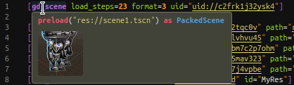
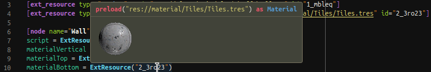

# Godot Files

Provides syntax-coloring for some files supported by Godot Editor.  
This is *not* meant to replace the [godot-tools] extension, but to improve on its supported files. This plugin can work alongside godot-tools, but it's independent and does not require it or Godot Editor to provide any functionality.

[godot-tools]: https://github.com/godotengine/godot-vscode-plugin

**Compatibility**: Godot 3.x, 4.0

## Features

Includes syntax-coloring for these languages:

- Godot Shader files: `.gdshader`, `.gdshaderinc`.
- Better (more specific) grammar for the INI-like files used by Godot (Asset Properties Definition):  
  `.godot`, `.tscn`, `.escn`, `.tres`, `.gdns`, `.gdnlib`, `.import`, `.tet`, `.remap`.
- The same grammar is reused for `.cfg` and the INI-like XDG Desktop Entry files: `.desktop`, `.directory`.  
  You might want to associate this language (Configuration Properties) with other INI-like formats as well.

INI-like files also support:

- Outline and breadcrumb items.

GDAsset files (i.e., the INI-like Godot Asset files) also support:

- Syntax-coloring of embedded code in asset strings for GDScript and Godot Shader resources.
- Navigate to definition of Ext/Sub Resource references, and to resource paths.
- Hover resource references or paths to show code for loading in GDScript (`preload(…)`, `load(…)` or `FileAccess.open(…)`).  
  
- Hover image and font resource paths/references to preview them directly (only some formats are supported).  
    
  The font preview shows all UPPER and lower case ASCII letters, and helps testing if they're too similar to numbers:  
  
- **✨ EARLY ACCESS: ✨**  
  Hover any resource to preview its thumbnail, as it was generated by Godot Editor (it doesn't need to be running).  
  It works for scenes:  
    
  As well as any other resources that have a thumbnail in Godot Editor:  
    
  Note: If you're using Godot in self-contained mode, this requires adding the cache path in the settings.

If you want **more features**, check the [section](#potential-future-development) about future development below.

## Early Access

The feature in early access is ready for use, but **restricted to supporters** until the next new feature takes its place in a future version. To unlock all features as soon as they are released, [donate] and copy the password that you'll get, then use the **Godot Files: Unlock features in early access** command (right-click the extension in the Extensions panel) and paste the password in the prompt. Doing this just once will permanently unlock it, even across updates.

## Known Limitations

Parsing of INI-like files is very simplistic (line-based; doesn't use a robust parser library), but should work well for almost all cases where files were generated by Godot. A few corner cases might not match, specially if you manually edit files (e.g., a line with an array value like `[null]` may be interpreted as a section). Also, `ext_resource` paths containing comment chars (`#` or `;`) are not parsed properly in outline; this causes issues in hover too.

VSCode only recognizes a word token properly when hovering or placing the cursor within its first 32 characters. So, for long paths, you only get the tooltip when hovering this initial part of the path.

VSCode is not recognizing "embeddedLanguages" as expected for some reason, so, if you edit code inside GDAsset strings, then things like toggling comments, snippets, etc. won't consider the embedded language's context.

## Support

This software is free and in the [public domain]. It respects your privacy by not collecting any data.  
👍 If you think this is useful, please star the [GitHub repo] and give it a rating on [VS Marketplace] or [Open-VSX].  
❤️ [Itch Store] | [ArtStation] | [Unity Assets]  
🌐 [GitHub] | [Bitbucket] | [Reddit] | [YouTube]

[donate]: https://alfish.itch.io/godot-files-vscode
[public domain]: https://unlicense.org/
[GitHub repo]: https://github.com/AlfishSoftware/godot-files-vscode
[VS Marketplace]: https://marketplace.visualstudio.com/items?itemName=alfish.godot-files
[Open-VSX]: https://open-vsx.org/extension/alfish/godot-files
[Itch Store]: https://alfish.itch.io/
[ArtStation]: https://www.artstation.com/a/26333626
[Unity Assets]: https://assetstore.unity.com/publishers/30331
[GitHub]: https://github.com/AlfishSoftware
[Bitbucket]: https://bitbucket.org/alfish/workspace/repositories
[Reddit]: https://www.reddit.com/user/AlfishSoftware/
[YouTube]: https://www.youtube.com/channel/UCMaO6Qb1IcyEBo7AcMlQ78g

---

## Potential Future Development

You might have commercial interest in funding development of this extension or of a **specific feature** that you want. Or maybe you're a kind soul with the means to contribute for the benefit of the community.

In any case, when you [donate], you get not only the password to unlock **early access** explained [above](#early-access), but also the right to optionally **vote on a new feature**. If there's enough funding from the community, development will start/progress, prioritizing the most voted/funded feature. Any amount helps a lot!

Each $ below means about a week of work needed to implement the feature. These guesses are very rough estimates, and this list may change.

### Godot Asset

Id | Weeks | Possible Feature
-|-|-
aColor | $ | Inline Color Decorators
aGotoDocs | $$$ | Go to Online Docs of GDScript built-in types

### Godot Shader

Id | Depends on | Weeks | Possible Feature
-|-|-|-
sParser | | $$$$$$$$ | Preprocessor + Parser, independent of Godot Editor
sSyntaxErr | sParser | $ | Report Syntactical Errors
sOutline | sParser | $ | Outline / Breadcrumbs + Go to Workspace Symbol
sGotoDef | sParser | $ | Go to Definition in User Code
sHighlight | sGotoDef | $ | Highlight Occurrences
sSemantic | sParser | $ | Semantic Coloring
sLangCompl | sParser | $ | Basic Completions (Keywords, Snippets)
sUserDocs | sParser | $$ | User API Documentation
sUserCompl | sParser | $$ | User API Completions
sUserSign | sParser | $$ | User API Signature Help
sCoreApi | | $$$ | Structured Built-in API + Docs (fetch online)
sGotoDocs | sCoreApi, sParser | $ | Go to Online Documentation
sFindRef | sCoreApi, sHighlight | $ | Find References
sRename | sCoreApi, sFindRef | $ | Rename Refactoring
sCoreDocs | sCoreApi, sParser | $$$ | Built-in API Documentation
sCoreCompl | sCoreApi, sParser | $$$ | Built-in API Completions
sCoreSign | sCoreApi, sParser | $$$ | Built-in API Signature Help
sSemErr | sCoreApi, sSyntaxErr | $$$$ | Report Some Semantic Errors

<!-- No plans for: sFixErr, sCodeLens, sColor, sFormatFile, sFormatSel, sFormatAuto -->
