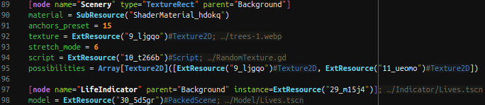

# Godot Files

**Additional features for some Godot files, better syntax-coloring and very basic GDShader support.**  
Godot Editor does NOT need to be running for any features here.

[godot-tools]: https://github.com/godotengine/godot-vscode-plugin

> ⏳ Thanks to 2 more big donations, the crowdfunding deadline was delayed again. Progress is currently very slow.  
> 🥺 Please help development by [donating to the crowdfunding goal][donate] so I can resume work here on new features!  
> 🔑 With a donation, you can **unlock early access and other rewards**! More info below.

*All screenshots use the [Semanticolors Dark][donate] color theme, available for both VSCode and Godot for a consistent experience.*

This is not meant to fully replace the official [godot-tools] extension, but to improve on its supported files. This plugin is designed so it can work alongside it, but it's completely independent. If you're using GDScript, you'll likely want to install godot-tools too; if not, just this one may be enough.  
🔧 You can use the setting `files.associations` to set your preferred extension to handle `*.tscn`, `*.tres`, etc.

**Compatibility**:

- **Godot**: 3.x LTS and 4.0 to 4.x; official and flathub builds
- **godot-tools**: v2.5.x; *("view documentation" feature can use godot-tools)*

🌐 This extension also works on browser IDEs ([vscode.dev](https://vscode.dev) and [github.dev](https://github.dev)), with minor limitations.

## Special Thanks
❤️ Huge thanks to everyone who has donated so far!  
There are special donation tiers if you also want to [get your logo or GitHub user listed][rewards] right here:

<!--

-->

<!--

-->

## Features
Features are supported on these languages:
- **GDShader** files: `*.gdshader`, `*.gdshaderinc`.  
	> 🔒 Very basic GDShader Language features are available on [early access][donate]. See below.
- "**GDAsset**" files (this term is used here to describe all INI-like files used by Godot):  
	`project.godot`, `*.tscn`, `*.escn`, `*.tres`, `*.gdns`, `*.gdnlib`, `*.import`, `*.tet`, `*.remap`.
- "**Configuration Properties**" (`config-definition`), used for other specific non-Godot INI-like files:  
	`*.cfg`, Git config files (`.gitconfig`, `.git/config`) and XDG Desktop Entry files (`.desktop`, `.directory`).

Webview features:
- **Godot Documentation Viewer**

### Syntax Highlighting
Includes better (more specific) grammars for syntax-coloring on all supported textual languages above.

"Configuration Properties" reuses the "GDAsset" grammar. It fits better than "INI" and "Properties" because it's "smarter" than regular INI. It supports sub-properties, literals (booleans, numbers, strings), quoted strings in section headers, `;`-separated lists, apostrophe (single quote) inside unquoted strings like `don't`, etc. You might want to associate this language with any other INI-like formats as well if you notice it fits better.

#### Embedded Code
Syntax-coloring of valid embedded code is supported.
- **GDAsset**: in asset strings for GDScript and GDShader resources.  
	😎 It even handles both inner and outer languages' escape sequences gracefully, and colors them differently:  
	
- **GDShader**: in `codeblock`-type BBCode tags in documentation comments (including `[gdscript]` and `[csharp]` tags).  
	✳️ Note that you should always put the inner code in its own lines verbatim, without the leading `*`, or any extra leading indentation.  
	

The inner code doesn't break the container code syntax, as long as it's valid code (without partial constructs like unterminated strings/comments, mismatched brackets, etc). Some cases are being handled, but it's not viable to try to safeguard against every possible case of invalid code; this is a limitation of the IDE.

### Document Symbols
Symbol definitions are provided for:
- 🔒 **GDShader** files (only in [early access][donate], see below).
- **GDAsset** files, as per their INI-like structure.
- **Configuration Properties** (non-Godot INI-like) files.

The IDE uses this in many places, like the **Outline** view, in **Breadcrumbs** and in the "**Go to Symbol in Editor**" feature (typing `@` in the command palette).

### Features in GDAsset files
These features are supported in textual Scene and Resource files.

#### Automatically shown

- **See inferred class and path of resource references** in inlay hints. You can <kbd>Ctrl</kbd>+Click them to navigate. You can also hover paths.  
	✳️ Paths are only shown at the end of a line (so not within arrays, but you can still hover the id to see the path in this case).  
	🔧 You can control this feature in the settings under `godotFiles.clarifyReferences` (`.filePath`, `.class` and `.asOperator`). By default, `.filePath` shows the minimal unique subpath (usually just the file name; folders are only shown to differentiate files with the same name). The class is not hinted where it can be inferred from the context, so in Godot 4 it won't be shown for `SubResource`, as it's already in the id (unless you set `.class` to `always`).  
	

- **See implied parentheses in packed arrays** of vectors or colors that surround items, similar to inlay hints.  
	🔧 You can toggle this feature with the settings under `godotFiles.clarifyArrays` (`.vector` and `.color`).  
	✳️ This feature respects `editor.maxTokenizationLineLength` to avoid potential performance issues on very long lines.  
	

#### Hovering

- **Preview images and fonts** by hovering their resource paths or `ExtResource` references.  
	🔧 You can disable resource previews when hovering with the setting `godotFiles.hover.previewResource`.  
	💻 On browser IDEs, this may only work for small files (approx. 74kB or less).
	
	  
	✳️ Images supported: SVG, PNG, WebP, JPEG, BMP, GIF.
	
	The font preview shows all uppercase and lowercase ASCII letters and helps testing if they're too similar to numbers:  
	  
	✳️ Fonts supported: TTF, OTF, WOFF, WOFF2.

- **Preview the thumbnail of a resource file** as generated by the Godot Editor by hovering its external reference.  
	Godot doesn't need to be running because it updates thumbnail files into the cache whenever a resource is saved.  
	🔧 The setting `godotFiles.hover.previewResource` also applies here.  
	💻 This feature is not available on browser IDEs, as it depends on the thumbnail cache that Godot writes on your PC.  
	⚠️ If you're using Godot in [self-contained mode](https://docs.godotengine.org/en/stable/tutorials/io/data_paths.html#self-contained-mode), this requires adding the cache path with the setting `godotFiles.godotCachePath`.
	
	It works for scenes:  
	
	
	As well as any other resource files that have a thumbnail in Godot Editor:  
	

- **See GDScript code for loading** a resource reference or path by hovering (`preload(…)`, `load(…)` or `FileAccess.open(…)`).  
	

- **Edit a color by hovering its inline decorator** on `Color(…)` values or within an array. You can also see its hex value.  
	🔧 You can disable this feature with the settings under `godotFiles.inlineColors` (`.single` and `.array`).  
	  
	✳️ The displayed color (and its hex value) can't consider advanced cases like HDR and color space changes (e.g. between sRGB and linear).

#### Commands

- **Navigate to the definition** of `SubResource` and `ExtResource` references, and to resource paths (<kbd>Ctrl</kbd> <kbd>Click</kbd> or <kbd>F12</kbd> by default).  
	  
	✳️ Going to the definition of a built-in engine type (on `type="SomeType"`, `some_field = SomeType(...)` or in inlay hints) will open its Godot API Documentation using the configured viewer (see below). But note that **GDScript is entirely handled by godot-tools** (not by this extension), so when using "Go to Definition" on a .gd file, they'll always use their own implementation to show the documentation.

### Latest feature no longer restricted
*Special thanks to [@cureforboredom](https://github.com/cureforboredom), whose donation allowed progress to be made!*

🌟 This is now out of early access:

#### Godot Documentation Viewer
Browse the online Godot Documentation directly from the IDE.  
⚙️ You can use the command ***Godot Files: Open Godot API Documentation*** (default shortcut: <kbd>Ctrl</kbd> <kbd>F1</kbd>; macOS: <kbd>⌥</kbd> <kbd>⌘</kbd> <kbd>D</kbd>) to show the page listing all classes, find a specific class under the text cursor, or search the selected text.  
🔧 The setting `godotFiles.documentation.viewer` lets you choose your preferred viewer for when you're online (the features supported depend on this choice):
- `godot-tools`: Use the *godot-tools* extension to open API docs (offline; requires Godot to be running and connected; only supports English).
- `browser`: Open online documentation URLs in the external browser.
- 🌟 `simple-browser`: Use the *Simple Browser* built-in extension to open documentation URLs in an IDE tab. Cannot open multiple tabs. The same tab is always reused.
- 🌟 `webview`: Load online documentation pages internally within IDE tabs. You can still use the command to open the page externally.  
	🔧 You can set some preferences for this viewer in the settings under `godotFiles.documentation.webview`.

If you want **more features**, check the sections **Early Access**, **Crowdfunding** and **Potential Future Development** below.

## Early Access

Features in early access are ready for use, but **restricted to supporters** at first.  
Each feature will stay restricted until the next new feature takes its place in a future version, usually months later.

🔑 To unlock all features as soon as they arrive, please [donate] and copy the password, then use the ***Unlock features in early access*** command (right-click this extension in the Extensions panel) and paste it in the prompt. Doing this **just once will permanently unlock** everything in early access, even across updates.

The features below are currently restricted.

### International Godot Documentation
🔒 You can browse the online manuals in languages other than English (except on the `godot-tools` viewer).  
🔧 The setting `godotFiles.documentation.locale` lets you choose your preferred language. Leave it as `auto` to use the IDE language.  
✳️ Note that translations from the community are often incomplete (partial, outdated, not all versions supported) and the API is currently still in English for most languages.

### Resolve uid paths
🔒 Resolve `uid://…` strings into their `res://…` paths. This allows many things on these references:
- Navigate to the definition (<kbd>Ctrl</kbd> <kbd>Click</kbd> or <kbd>F12</kbd> by default).
- See the resolved path and its preview when hovering.
- See the resolved path in inlay hints.
- If you double-click the inlay hint, you can replace the uid in the string with its path (useful in `project.godot` and `@export_file` values).

✳️ The IDE has a character limit per line for inlay hints. So on lines with multiple items (e.g. in arrays) they only appear for some (you can still hover the uid to see the path).  
✳️ If the mapping is not found locally in the document itself, the global uid cache is consulted.  
🔧 The setting `godotFiles.clarifyReferences.filePath` also applies here. But note that `minimal` only shortens `ext_resource` paths found locally in the document. When it comes from the global uid cache, the full `res://…` path is shown.  

### GDShader Language Features
After a huge effort, basic support for GDShader language features is finally available! 🎉  
It's completely independent from Godot Editor and **doesn't require Godot to be running** or even available, so it works on browser IDEs too.

🔧 The setting `godotFiles.shader.analysisLevel` can be used to restrict how far the analysis goes, which affects all of these features.
- 🔒 Standalone **GDShader Preprocessor** for IDEs.
	- 🔒 Preprocessor error diagnostics (squiggles).
	- 🔒 Preprocessor symbol definitions in outline and breadcrumbs.
	- 🔒 Preprocessor marking inactive `#if…#endif` regions with less opacity.  
	🔧 The setting `godotFiles.inactiveRegionOpacity` changes the transparency of the inactive regions.
- 🔒 **GDShader Lexer**, using ANTLR4.
	- 🔒 Lexical error diagnostics (squiggles).
- 🔒 **GDShader Parser**, using ANTLR4.
	- 🔒 Syntactical error diagnostics (squiggles).
	- 🔒 Syntactical symbol definitions in outline and breadcrumbs.

Note that you will only get error squiggles for the checks above, as analyzers for **semantic errors are not implemented yet** (so no type errors, name errors, control flow errors, usage errors, etc). This means files that show no errors here can still raise errors in the Godot Editor. This work is only the beginning.

The preprocessor produces sourcemapping for all ranges within `#include` and macro expansions, so e.g. errors from an included file refer to the actual source.

## Crowdfunding

This extension is free, but making it is not free at all. Development of features took a huge amount of work (specially of GDShader language features in particular). This should be only the start, but it's **not possible to make any further progress** in this extension without enough [donations][donate] 📉. Yet I really want this extension to continue as free software in public domain, with no ads. So I have no choice - I have to request a sort of "crowdfunding", to see whether this project can continue at all or has to be abandoned (meaning no more new features 😢). [Full explanation here](https://github.com/AlfishSoftware/godot-files-vscode/issues/3).

A [**collective donation goal**][donate] was set, to compensate the amount of work (commits, days) **already done** to implement the features.  
**If the goal is not reached by the community within the time limit, then the project has to be abandoned**.

By donating, you make development possible, helping yourself and everyone else at the same time, so please do if you have the means to, specially if you want proper GDShader support in VSCode or any other features listed in the **Potential Future Development** section below.

## Support

This software is free and in the [public domain]. It respects your privacy by not collecting any data.  
👍 If you think this is useful, please star the [GitHub repo] and give it a rating on [VS Marketplace] or [Open-VSX].  
🛒 [Itch Store] | [Unity Assets]  
🌐 [GitHub] | [Bitbucket] | [Reddit] | [YouTube]

[donate]: https://alfish.itch.io/godot-files-vscode
[rewards]: https://alfish.itch.io/godot-files-vscode#rewards
[public domain]: https://unlicense.org/
[GitHub repo]: https://github.com/AlfishSoftware/godot-files-vscode
[VS Marketplace]: https://marketplace.visualstudio.com/items?itemName=alfish.godot-files
[Open-VSX]: https://open-vsx.org/extension/alfish/godot-files
[Itch Store]: https://alfish.itch.io/
[Unity Assets]: https://assetstore.unity.com/publishers/30331
[GitHub]: https://github.com/AlfishSoftware
[Bitbucket]: https://bitbucket.org/alfish/workspace/repositories
[Reddit]: https://www.reddit.com/user/AlfishSoftware/
[YouTube]: https://www.youtube.com/channel/UCMaO6Qb1IcyEBo7AcMlQ78g

## Third-party Notices

When accessing 3rd-party websites, you may be subject to their privacy policies.  
Also, content may be automatically fetched from GitHub, Bitbucket and Godot websites, as necessary.

Content from **Godot** is available under the licenses found in their repositories for [code/API](https://github.com/godotengine/godot) and for [documentation](https://github.com/godotengine/godot-docs).

The included [**ANTLR4 Runtime Library**](https://www.npmjs.com/package/antlr4) is distributed under the **BSD-3-Clause** license, found in [their repository](https://github.com/antlr/antlr4).

## Known Minor Limitations

VSCode only recognizes a word token properly when hovering or placing the cursor within its first 32 characters. So, for long paths, you only get the tooltip when hovering this initial part of the path.

Some commands like the buttons in the Godot Docs webview might not work consistently when using aux / floating windows or dragging tabs to different tab groups.

Parsing of INI-like files is very simplistic (line-based; doesn't use a robust parser library), but should work well for almost all cases where files were generated by Godot. A few corner cases might not match, specially if you manually edit files (e.g., a line with an array value like `[null]` may be interpreted as a section). Also, `ext_resource` paths containing comment chars (`#` or `;`) are not parsed properly in outline; this causes issues in hover too.

---

## Potential Future Development

The features below are theoretically feasible (if the project isn't abandoned).  
Each $ means about a week of work needed to implement it. These are very rough estimates, and this list may change.

### Textual GDAsset

Id | Weeks | Possible Feature
-|-|-
aArrayCount | $ | Show array size and element indices
aHoverCartesian | $$$$$ | Cartesian hover previews for some coordinate values like vector, quat, basis, etc

### Binary Godot Asset

Id | Weeks | Possible Feature
-|-|-
bDecode | $$ | Read-only textual GDAsset code (tres, tscn) for binary resource files (res, scn, etc.)
bTexView | $$ | Open .stex and .ctex texture files like images

### GDShader

Id | Depends on | Weeks | Possible Feature
-|-|-|-
sProjSymbol | ~~sParser~~ | $ | Go to Workspace Symbol
sGotoDef | ~~sParser~~ | $ | Go to Definition in User Code
sHighlight | sGotoDef | $ | Highlight Occurrences
sLangCompl | ~~sParser~~ | $ | Basic Completions (Keywords, Snippets)
sUserDocs | ~~sParser~~ | $$ | User API Documentation
sUserCompl | ~~sParser~~ | $$ | User API Completions
sUserSign | ~~sParser~~ | $$ | User API Signature Help
sCoreApi | sUserDocs | $$$ | Structured Built-in API + Docs (fetch online)
sGotoDocs | sCoreApi, ~~sParser~~ | $ | Go to Online Documentation
sFindRef | sCoreApi, sHighlight | $ | Find References
sRename | sCoreApi, sFindRef | $ | Rename Refactoring
sCoreDocs | sCoreApi, ~~sParser~~ | $$$ | Built-in API Documentation
sCoreCompl | sCoreApi, ~~sParser~~ | $$$ | Built-in API Completions
sCoreSign | sCoreApi, ~~sParser~~ | $$$ | Built-in API Signature Help
sSemColor | sCoreApi, ~~sSyntaxErr~~ | $ | Semantic Coloring
sSemErr | sSemColor | $$$$ | Report Some Semantic Errors

<!-- No plans for: sFixErr, sCodeLens, sColor, sFormatFile, sFormatSel, sFormatAuto -->
